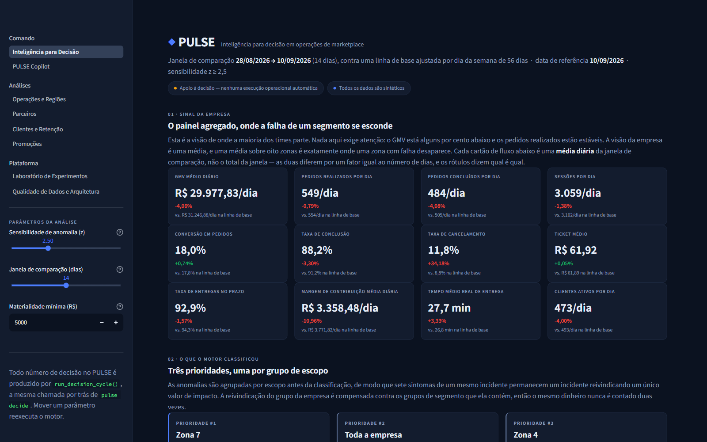
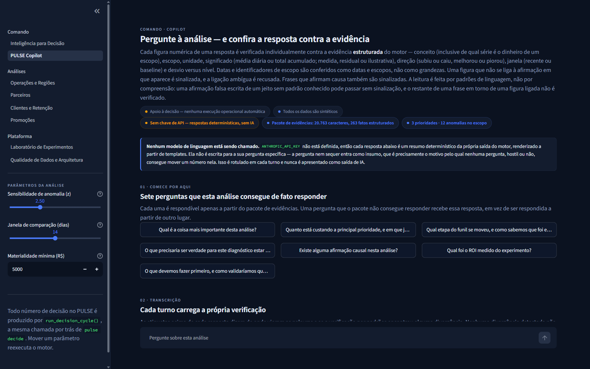
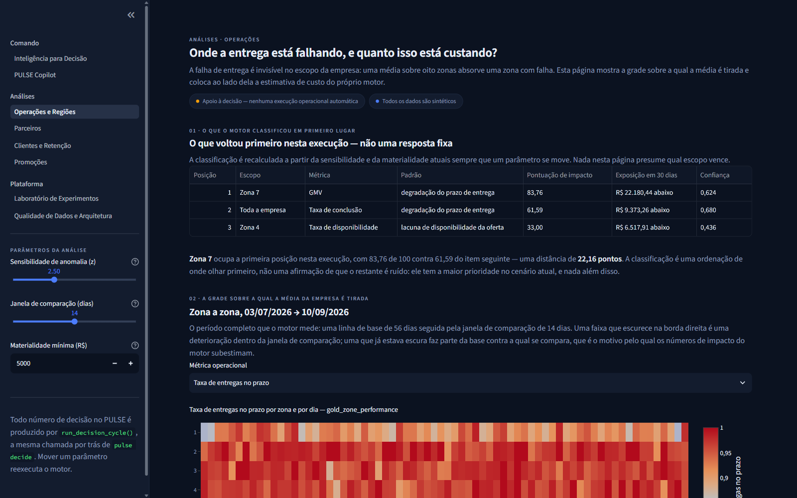
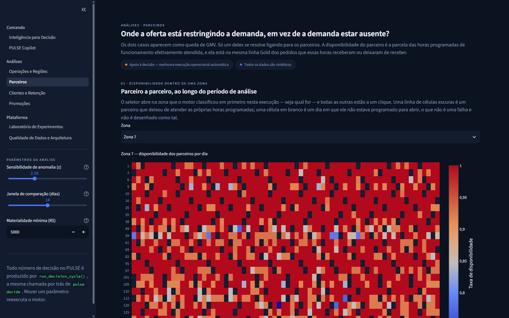
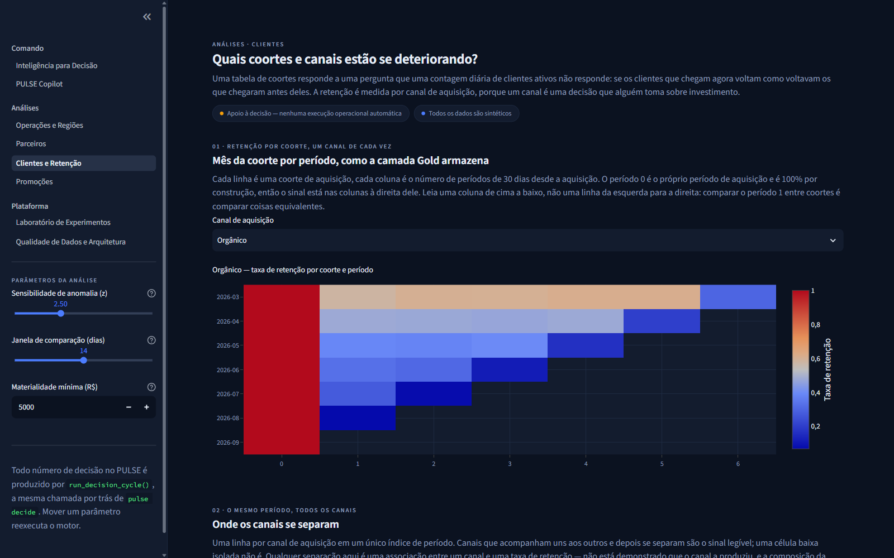
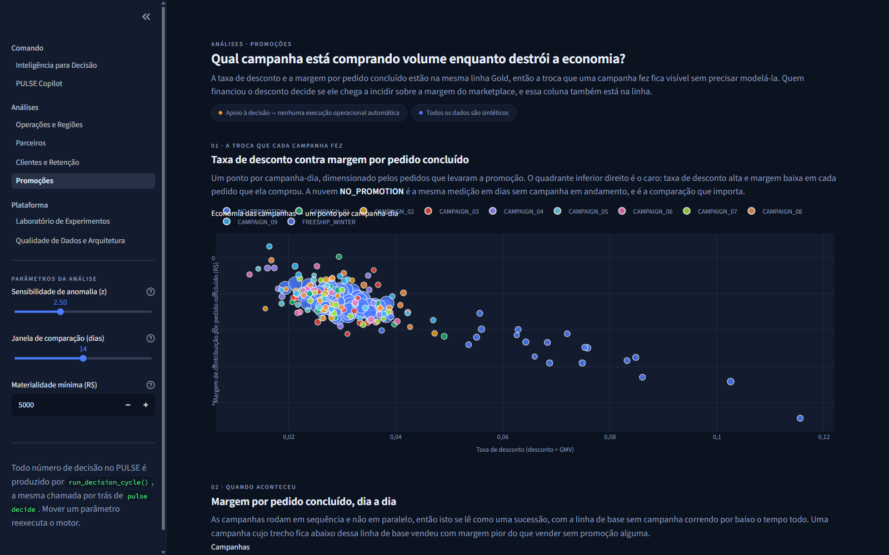
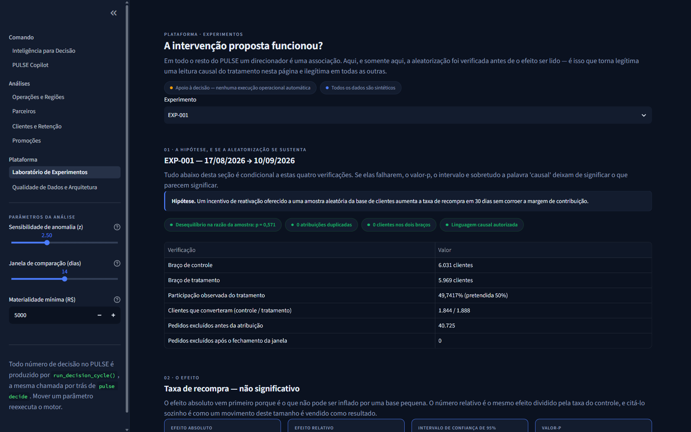
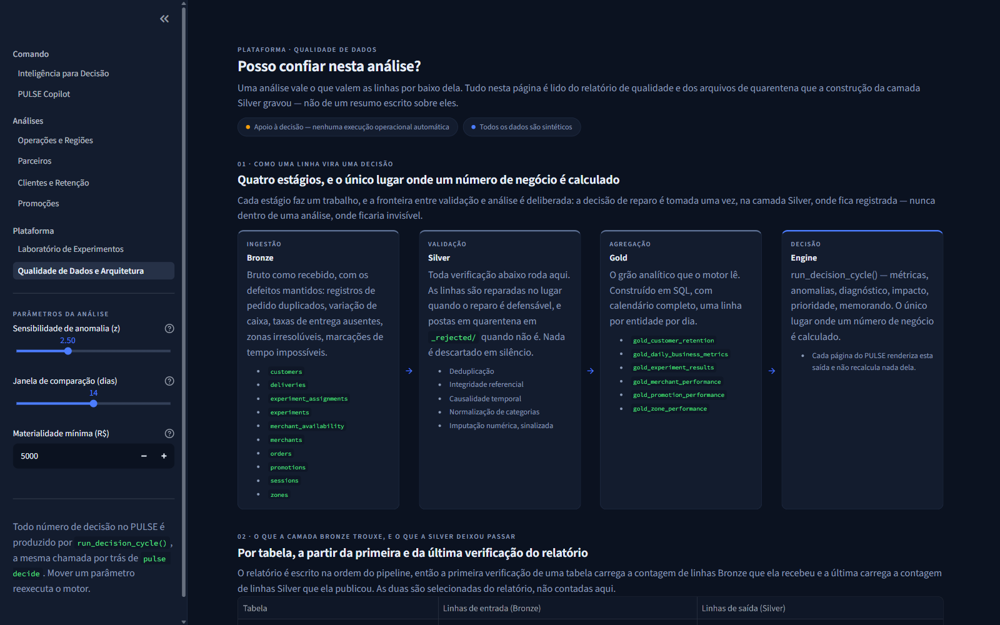

# PULSE — Marketplace Decision Intelligence

**PULSE is a decision-intelligence engine for marketplaces: it detects a business
change, explains where it sits and what moved with it, estimates how much it is
worth, ranks it against everything else that fired, writes a Decision Memo a named
human approves, and — where a randomised experiment exists — says whether the
intervention worked.**

> **ALL DATA IS SYNTHETIC.** The project is informed by prior experience with
> digital operations and marketplaces but contains no proprietary company data.
> There is no real customer, company or client data of any kind in this
> repository. Every figure below demonstrates a method, not a market.

## At a glance

**Problem.** A marketplace emits signals per zone, per metric and per funnel stage
every day. Averaged together they hide the one that matters, and viewed one by one
they are too many to act on. The job is to turn those fragmented signals into a
short, ranked list of decisions a person can approve.

**What PULSE does.**

```
DATA → DETECTION → DIAGNOSIS → IMPACT → PRIORITY → EVIDENCE → NARRATION
```

Synthetic marketplace data is built into Bronze / Silver / Gold layers with DuckDB
SQL; a day-of-week-adjusted detector scans every metric at every scope; each anomaly
is diagnosed (segment contribution, funnel log-decomposition, associated drivers);
impact is estimated in the scope's own GMV, orders and margin; scope groups are
ranked by a documented score; each priority becomes a Decision Memo carrying its
evidence and a playbook recommendation for a human to approve; and an optional
language model narrates.

**Principle — ENGINE DECIDES. LLM NARRATES.** Every metric, anomaly, score, ranking
and recommendation is computed by a deterministic engine. The language model only
receives a bounded bundle of structured evidence and writes prose about it: the
segment, period, confidence, recommended action and metric list in its answer are
taken from the engine, and a pattern-based validator flags figures it cannot bind
to the evidence and sentences that assert causation. The validator **detects**
divergence; it never presents an answer as certified. See
[The Copilot boundary](#the-copilot-boundary).

| | |
|---|---|
| **Stack** | Python 3.12 · pandas · DuckDB · Parquet · SciPy · Streamlit · Plotly · Anthropic SDK · pytest (managed with uv) |
| **Data** | 100% synthetic and seeded over a fixed window — no real company, customer or client data |
| **Tests** | 656 tests: 655 passed, 1 skipped (the Databricks reconciliation, which needs a real workspace) |
| **Runs without an API key** | Yes — the Copilot then answers from a deterministic template, labelled as not AI output |
| **Not included** | No Power BI artifact. The PySpark/Databricks script is written but has never been executed |



### Quick start

Requires Python 3.12 and [`uv`](https://docs.astral.sh/uv/).

```bash
uv sync
uv run pulse generate     # synthetic Bronze data (seeded)
uv run pulse build        # DuckDB SQL: Bronze -> Silver -> Gold
uv run pulse decide       # artifacts/decisions.json + artifacts/decision-memo.md
uv run pulse run          # the Streamlit application
uv run pytest             # the full test suite
```

**Contents:** [Architecture](#architecture) ·
[Synthetic dataset](#the-synthetic-dataset) ·
[Pipeline](#pipeline--bronze--silver--gold) ·
[Decision engine](#the-decision-engine) ·
[Experiments](#experiments--where-causal-language-becomes-legitimate) ·
[Copilot boundary](#the-copilot-boundary) ·
[Application and screenshots](#the-streamlit-application) ·
[Testing](#testing) ·
[Limitations](#limitations) ·
[How to run](#how-to-run) ·
[License](#license)

---

## The problem

A marketplace operations team opens a dashboard. Company GMV is off 4%. Orders
placed are flat. Nothing on the page is obviously wrong, and nothing on the page
says what to do.

That is the real failure mode of business intelligence: an average over eight
zones is exactly where one failing zone disappears. On this dataset the company
GMV line does not even clear the detector's own sensitivity floor (z = −2.22
against a threshold of 2.5), while one zone inside it is running a 15% collapse
in completion rate. The dashboard is not wrong. It is silent.

Drilling down does not fix this either. Drilling down is a human guessing which
slice to open. PULSE is the opposite operation: it scans every metric at every
scope it carries, groups the symptoms that belong to one incident, decomposes
the deviation, ranks what is left by money and evidence, and hands back three
memos in rank order.

## The thesis

```
WHAT HAPPENED?  ->  WHY?  ->  HOW MUCH DOES IT MATTER?  ->  WHAT SHOULD WE DO?  ->  DID IT WORK?
```

Two rules make that loop defensible rather than decorative.

**Facts are computed deterministically first; the language model never sees a
row.** Every number in this project is produced by a pure function over the gold
tables. The LLM receives a bounded JSON evidence bundle and may only write prose
about it. It cannot change a metric, a score, a ranking or a recommendation.

**Association is not causation, and the code says so.** Root cause returns
*associated drivers* — series whose daily movement correlates with the target's.
It never says "caused". The one place in this repository where causal language is
licensed is the Experiment Lab, and only after a randomisation check passes.

---

## Architecture

```
pulse generate  ->  data/bronze/*.parquet                 (seeded, once)
pulse build     ->  DuckDB over sql/*.sql -> silver -> gold
                                 |
            +--------------------+---------------------+
     pulse decide                                 streamlit run
   -> artifacts/decisions.json               -> the same pure functions
      artifacts/decision-memo.md                under st.cache_data
```

| Decision | Choice | Why |
|---|---|---|
| Shape | Modular monolith | No microservices, no orchestrator, no message bus. 1.17M rows and 13 MB of parquet. |
| Local engine | DuckDB + pandas over parquet | Real `.sql` files on disk, zero setup, sub-second over the whole dataset. |
| Spark layer | A PySpark/Delta script for Databricks | Written, **never executed here** — see below. |
| Execution model | ETL materialised once by CLI; decision intelligence computed live | One engine, two entry points. |
| LLM boundary | Engine decides, LLM narrates | The whole product works offline with no API key. |
| UI | Streamlit + Plotly | One deployable surface, no separate API. |
| Auth / multi-user | None | Out of scope by design. |

### One engine, structurally

There is exactly one orchestrator, `run_decision_cycle()` in
[`src/pulse/engine.py`](src/pulse/engine.py). The CLI and every Streamlit page
import and call it. `src/pulse/cli.py` imports none of `detect_anomalies`,
`diagnose`, `estimate_impact`, `prioritize` or `recommend` — a test asserts those
names are absent from that file, so a second engine cannot be born in the CLI
without the suite failing. Another test compares the CLI-written
`artifacts/decisions.json` against a direct library call at full float precision.

---

## The synthetic dataset

Fixed window **2026-03-15 to 2026-09-10** (180 days), hard-coded rather than
relative to `today()`, so the dataset is reproducible indefinitely. The analysis
"as of" date is 2026-09-10. Seeded with `numpy.random.Generator(PCG64(42))`.

| Table | Grain — one row per… | Rows |
|---|---|---|
| `zones` | zone | 8 |
| `merchants` | merchant | 150 |
| `customers` | customer | 25,000 |
| `sessions` | marketplace session | 558,659 |
| `orders` | order | 100,521 |
| `deliveries` | order that entered dispatch | 95,827 |
| `promotions` | promotion definition | 10 |
| `experiments` | experiment definition | 1 |
| `experiment_assignments` | experiment × customer | 12,000 |
| `merchant_availability` | merchant × hour of the operating window | 378,000 |
| | **total** | **1,170,176 rows / 13.4 MB** |

Two of those tables exist for reasons worth stating.

**`sessions` exists because conversion needs a denominator.** Orders supply only
the numerator. Without a visit grain, conversion would have to be hard-coded,
which the project forbids. 558,659 sessions produce 99,523 placed orders =
**17.81% order conversion**, measured, not assumed.

**`merchant_availability` exists because an absence produces no rows.** A closed
merchant emits no orders, so "the merchant was shut" cannot be inferred from the
order table. That requires a *periodic snapshot fact table*: one row per merchant
per hour of the 14-hour operating window (10:00–23:59), emitted whether or not
anything happened. 150 × 14 × 180 = 378,000 rows.

The same reasoning drives the **calendar spine** in the gold SQL. A plain
`GROUP BY order_date, zone_id` emits no row for a zone-day with zero completed
orders — so the worse a zone gets, the more of its bad days silently vanish and
the detector sees a *shorter* series rather than a *worse* one. Left-joining a
`generate_series` spine crossed with the zone dimension forces a zero row to
exist. In both cases the signal is an absence, and absences must be manufactured
into rows before analysis can see them.

### Injected incidents, and what the engine found

Four incidents are injected by
[`src/pulse/incidents.py`](src/pulse/incidents.py) as pure functions returning
multipliers on *rates*, never on outputs. Ground truth is written to
`data/ground_truth/injected_incidents.json`, deliberately outside
`bronze/silver/gold`. **Only `tests/` may read it.** A test greps `src/pulse/`
and `app/` and fails if either mentions `ground_truth`; another moves the
directory away entirely and asserts the engine's output is byte-identical
without it.

| # | Injected | Days | Engine result |
|---|---|---|---|
| 1 | Zone 7 fulfilment degradation | 150–180 | **Rediscovered and ranked #1** |
| 2 | Zone 4 peak merchant availability | 158–180 | **Rediscovered and ranked #3** |
| 3 | `FREESHIP_WINTER` margin erosion | 152–172 | Not surfaced — structural |
| 4 | `paid_social` retention decay | signups 120+ | Not surfaced — structural |

**The engine, which reads no ground truth, independently surfaced two of the four
and ranked them.** The two it did not surface are the interesting half, and both
reasons are structural limits of a daily-series detector rather than calibration
failures:

- **The promotion runs 21 days** (2026-08-14 → 2026-09-03). One baseline window
  plus one comparison window is 70 days. A campaign whose entire life is shorter
  than the window it would be compared against sits *inside its own baseline* —
  there is no uncontaminated period to measure it from, and no daily series can
  detect it.
- **The retention dataset has no date column at all.** Its grain is
  `(cohort_month, acquisition_channel, period_index)`. There is no daily series
  to scan, so the detector has nothing to run on.

Both facts are asserted in the recovery test
(`test_every_injected_incident_on_a_carried_dimension_is_rediscovered`), which
measures the promotion's span and checks `"metric_date" not in
gold.customer_retention.columns` — so wiring in either dimension without wiring
in its detection fails loudly instead of passing silently.

**Zone 7 and Zone 4 are the analytic point of the dataset.** Identical headline
symptom, mechanically distinguishable root cause:

| | Zone 7 | Zone 4 |
|---|---|---|
| sessions | stable | stable |
| order conversion | **stable** | falls |
| completion rate | **falls** | stable |
| broken stage | `completion_rate` | `availability_rate` |
| associated drivers | fulfilment cluster, moderate | none above threshold |
| failure locus | post-checkout | pre-checkout |

---

## Pipeline — Bronze / Silver / Gold

### Bronze — raw, with defects left in

Generator output plus seeded quality defects injected *after* clean generation,
counted into `data/ground_truth/quality_defects.json` so the tests can check the
Silver build caught exactly what was planted.

| Defect | Injected |
|---|---|
| Exact duplicate order rows | 797 |
| Null `delivery_fee` | 1,507 |
| Null `zone_id` on sessions | 2,793 |
| Payment-method casing drift (`credit_card` / `CREDIT_CARD` / `cc`) | 12,062 |
| `delivered_ts < order_ts` | 287 |
| Orphan `merchant_id` FK | 201 |
| Merchant category drift (`Pizza` / `pizza` / `PIZZA `) | 3 |

Merchant-category drift is deliberately Pizza-only and small: the spec authorises
category variants for one category, so three rows is the honest size of it rather
than a number inflated to look impressive.

### Silver — cleaned, typed, conformed, and *quarantined*

Rejected rows are quarantined, never dropped:
`data/silver/_rejected/<table>.parquet` carries a `reject_reason` column.

| Check | Rows in | Rejected | Repaired |
|---|---|---|---|
| `orders_deduplicate` | 100,521 | 797 | — |
| `orders_merchant_fk_integrity` | 99,724 | 201 | — |
| `orders_payment_method_normalised` | 99,523 | 0 | 10,400 |
| `orders_delivery_fee_imputed` | 99,523 | 0 | 1,496 |
| `sessions_zone_id_resolution` | 558,659 | 0 | 2,793 |
| `deliveries_timestamp_causality` | 95,827 | 287 | — |
| `merchants_category_normalised` | 150 | 0 | 3 |
| `deliveries_order_id_references_orders` | 95,540 | 194 | — |

Two rules do the work:

- **Numeric measures may be imputed; categorical identifiers never are.** A
  missing `delivery_fee` is filled from the zone median and the row sets an
  `is_imputed` flag. A null `zone_id` on a session is resolved only from a
  deterministic, unambiguous relationship (the customer's home zone) — otherwise
  the row is quarantined. Imputing an identifier invents a fact.
- **Every step appends to `data/silver/_quality_report.parquet`** (`check_name,
  table, rows_in, rows_out, rows_rejected, rows_repaired, rule, run_ts`). That
  file *is* the Data Quality page's data source. There is no hand-written quality
  number anywhere in the UI.

### Gold — six business-facing datasets

Declared in [`src/pulse/contracts.py`](src/pulse/contracts.py); the build checks
primary-key uniqueness and non-nullity after every write and raises
`GoldContractError` — an exception rather than an `assert`, so `python -O` cannot
strip it — so a grain violation cannot ship silently.

| Dataset | Grain | Rows |
|---|---|---|
| `gold_daily_business_metrics` | date | 180 |
| `gold_zone_performance` | date × zone | 1,440 |
| `gold_merchant_performance` | date × merchant | 27,000 |
| `gold_customer_retention` | cohort_month × acquisition_channel × period_index | 112 |
| `gold_promotion_performance` | date × promotion | 327 |
| `gold_experiment_results` | experiment × variant × date | 50 |

SQL is real `.sql` files on disk under [`sql/`](sql), executed by DuckDB directly
against parquet — not an ORM, not pandas dressed up as SQL. Techniques exercised
because the data needs them: CTEs, `ROW_NUMBER() … QUALIFY` for dedupe, `LAG` for
period-over-period deltas, `FILTER (WHERE …)` aggregates, a cohort self-join for
retention, and `generate_series` for the calendar spine.

---

## The decision engine

Analysis functions take DataFrames and return frozen dataclasses. The one
exception that touches disk is the distinct-customer count inside
`estimate_impact`, which reads (and caches) `silver.orders`, because a windowed
distinct count cannot be built from daily gold rows.

```python
compute_metrics(gold, params)        -> MetricFrame
detect_anomalies(metric_frame, p)    -> list[Anomaly]
diagnose(anomaly, gold, p)           -> Diagnosis
estimate_impact(diagnosis, gold, p)  -> Impact
prioritize(pairs, p)                 -> list[Priority]
recommend(diagnosis, impact)         -> Recommendation
build_memo(priority, recommendation) -> DecisionMemo

run_decision_cycle(gold, params)     -> DecisionCycleResult   # THE orchestrator
```

Three parameters are exposed live in the UI — sensitivity, comparison window,
minimum materiality — and moving any of them re-runs the whole cycle. The point
is to prove recomputation, not to build an analyst configuration product.

### Anomaly detection

A day-of-week-adjusted, two-sample z-scan over the whole metric register at every
scope the `MetricFrame` carries (company and zone).

```
z = (recent_mean − baseline_dow_mean) / (resid_std · sqrt(1/n_recent + 1/n_baseline))
```

Fires only when **all** of these hold: `|z| ≥ sensitivity`, `|deviation| ≥ 3%`,
BRL-denominated metrics clear the materiality floor, and a **persistence gate** —
both halves of the comparison window must move the same way and each must carry
at least half the sensitivity on its own standard error.

Four details that are not decoration:

- **Day-of-week adjustment is not optional.** Weekend seasonality accounts for
  about 65% of baseline GMV variance in the default 56-day window (R² of the
  day-of-week group-mean fit); a naive z-score trips every Saturday.
  The dispersion tested against is the residual std *after* removing the weekday
  effect, not the raw std, which is inflated by exactly the seasonality just
  modelled.
- **The two-sample standard error includes baseline estimation error.** The
  day-of-week expectation is itself estimated from the baseline window. Dividing
  by `resid_std/sqrt(n_recent)` alone treats it as exact and overstates z by ~12%
  at the default 14/56 windows.
- **NaN means "not measured", never zero.** `avg_actual_delivery_minutes` is NaN
  on a zero-delivery day; filling it with 0.0 would assert instant delivery.
- **The scan is register-wide, not GMV-only.** A zone-local failure can be
  diluted below the floor on company volume metrics while moving the company
  *rate* metrics hard — which is exactly what happens here.

**12 anomalies fired** on the default run (z ≥ 2.5, 14-day comparison window,
R$5,000 materiality):

| Metric | Scope | Recent | Baseline | Δ% | z |
|---|---|---|---|---|---|
| `availability_rate` | zone 4 | 0.907 | 0.961 | −5.69 | **−6.58** |
| `avg_actual_delivery_minutes` | zone 7 | 31.75 | 25.58 | +24.10 | +5.64 |
| `avg_promised_eta_minutes` | zone 7 | 33.56 | 30.97 | +8.36 | +5.58 |
| `on_time_rate` | zone 7 | 0.801 | 0.909 | −11.93 | −5.40 |
| `cancellation_rate` | company | 0.118 | 0.088 | +34.18 | +5.40 |
| `completion_rate` | company | 0.882 | 0.912 | −3.30 | −5.40 |
| `cancellation_rate` | zone 7 | 0.266 | 0.134 | +97.97 | +5.00 |
| `completion_rate` | zone 7 | 0.735 | 0.866 | −15.17 | −5.00 |
| `avg_actual_delivery_minutes` | company | 27.73 | 26.84 | +3.33 | +4.67 |
| `contribution_margin` | company | 3,358 | 3,772 | −10.96 | −4.01 |
| `gmv` | zone 7 | 4,756 | 5,496 | −13.45 | −2.88 |
| `orders_completed` | zone 7 | 75.1 | 85.1 | −11.65 | −2.65 |

### Diagnosis

Four computed steps, none asserted.

**1. Segment contribution.** The company-level deviation decomposed across one
dimension's segments, *signed*, so an offsetting segment stays visible (a share
of −40% means that segment moved favourably and is masking the total). Shares are
taken against the sum of segment deviations, so they total 100% by construction,
and the whole decomposition is skipped when the deviations cancel to near zero —
no decomposition beats a fake one printing +3000% / −2900%. Only additive metrics
get one: zone completion rates do not sum to a company completion rate.

**2. Funnel log-decomposition.** GMV is an exact identity:

```
GMV = sessions × order_conversion × completion_rate × AOV
```

verified daily to 1e-12 in gold. Taking logs makes the percentage changes
additive, so the largest-magnitude term **is** the broken stage — computed, not
chosen. On Zone 7:

| Stage | Recent | Baseline | Δ% | log contribution |
|---|---|---|---|---|
| sessions | 547.6 | 556.9 | −1.68 | −0.0169 |
| order conversion | 0.1877 | 0.1758 | +6.76 | +0.0655 |
| **completion rate** | **0.7345** | **0.8659** | **−15.17** | **−0.1645** |
| AOV | 63.17 | 64.55 | −2.13 | −0.0215 |

No stage is privileged: a demand-side incident would surface as `sessions`
through the identical code path. And a funnel in which nothing measurably moved
returns *no* break rather than handing the flag to whichever stage sorts first.

**3. Associated drivers — and the exclusion rule.**

This is the most defensible analytical decision in the project, so it is stated
as a rule rather than a hand-picked list:

> **A driver candidate must be plausibly operationally *upstream* of the broken
> funnel stage.**

Correlating an anomaly against its own arithmetic factors or its own downstream
consequences produces high coefficients that explain nothing. What the rule
excludes, and the measured coefficients that make the exclusion concrete:

| Excluded | Why |
|---|---|
| `sessions`, `order_conversion`, `completion_rate`, `aov` | The four funnel identity terms. GMV is their product, so they correlate with it by construction. Circular. |
| `cancellation_rate` | The arithmetic complement of `completion_rate` — every order either completes or cancels. On zone 7 the two measure **−0.478 and +0.478** against GMV: exactly mirrored, the signature of one quantity with a sign flip, not two signals. |
| `contribution_margin` | Downstream, not upstream. It is computed *from* completed orders and shares GMV's dominant term, measuring **+0.880** on zone 7. It would rank first and reclassify a fulfilment failure as a margin pattern — mistaking a consequence for an input. |
| `gmv`, `orders_placed`, `orders_completed` | Volume restatements of the same identity. |
| `availability_rate` | Genuinely upstream, so the *rule* does not exclude it. It is left out on evidence: the only scope where it moved is zone 4, where it is the **target**, and a series correlates with itself at 1.0. |

What survives: `avg_actual_delivery_minutes`, `avg_promised_eta_minutes`,
`on_time_rate`. On Zone 7:

| Driver | Recent | Baseline | Δ% | r | alignment | strength |
|---|---|---|---|---|---|---|
| actual delivery time | 31.7 min | 25.6 min | +24.1% | **−0.448** | +3d | moderate |
| promised ETA | 33.6 min | 31.0 min | +8.4% | −0.421 | +3d | moderate |
| on-time rate | 80.1% | 90.9% | −11.9% | +0.401 | +3d | moderate |

Correlation is Pearson on **pairwise-complete** observations; `.fillna(0)` would
drag the coefficient toward a number nobody observed. Temporal alignment is the
lag maximising |r| within ±3 days and is reported as evidence, **not** as a
direction of causation — on a sustained level shift the lag surface is nearly
flat, because every lag inside the window overlaps the same degraded regime.

**4. Pattern classification.** `(funnel_break_stage, classification_driver)` maps
to a playbook key through a **table, not branches**. Two rules govern what may be
added: a row must be *reachable* by some diagnosis this engine can actually
produce, and a row must map the *whole family* of drivers that describe one
operational signature, never one member.

| Broken stage | Driver | Pattern |
|---|---|---|
| `completion_rate` | any of the three fulfilment drivers | `fulfillment_eta_degradation` |
| `availability_rate` | `None` | `supply_availability_gap` |
| anything else | anything else | `unknown_pattern` (explicit fallback) |

A `None` driver is a positive finding, not a gap: "this metric moved and no
upstream operational candidate moved with it". Weak drivers are excluded from
classification entirely — a correlation the engine has already scored as worth
zero confidence must not be allowed to pick an action a human is asked to
approve.

### Impact and priority

**Two rules stop the same bug: claiming the same money twice.**

1. **Group by scope.** Seven zone-7 metrics fired. They are seven symptoms of one
   incident, not seven incidents. Anomalies are grouped by `(scope, scope_value)`,
   one Priority per group, impact computed once per group and denominated in the
   *scope's* own GMV, orders and margin rather than in whichever metric tripped
   the alarm. "13.2pp of cancellation rate" is not a number anyone can act on.
2. **Net an aggregate against its segments.** Company GMV is the sum of zone
   GMVs, so a company group and a zone group overlap by construction. The company
   group claims only the *residual*: its own deviation less what the segment
   groups in the same run already claim. Structural, never branching on a scope
   value.

The documented formulas, verbatim from
[`root_cause.py`](src/pulse/root_cause.py) and
[`prioritization.py`](src/pulse/prioritization.py):

```
confidence   = 0.25 · min(|z| / 5, 1)
             + 0.25 · top_segment_contribution_pct / 100
             + 0.30 · max|driver_correlation|      (weak drivers count as 0)
             + 0.20 · consecutive_anomalous_days / comparison_window_days

impact_score = 100 · ( 0.45 · norm(projected_30d_gmv_at_risk)
                     + 0.20 · norm(orders_lost)
                     + 0.15 · norm(customers_affected)
                     + 0.20 · confidence )
```

`norm` is min-max within the run's candidate set, anchored at zero rather than at
the smallest candidate — these are non-negative at-risk magnitudes with a real
absolute zero, and a floor at the smallest candidate would force whichever
candidate happens to be last to score 0 on every impact term however material it
is. Every component and weight is returned in `score_breakdown`, so the score is
reconstructable by hand from the object alone.

**The three priorities from the default run:**

| # | Scope | Pattern | Score | Confidence | 30-day exposure | Supporting anomalies |
|---|---|---|---|---|---|---|
| 1 | Zone 7 | `fulfillment_eta_degradation` | **83.76** | 0.624 | R$ 22,180 below | 7 |
| 2 | Company-wide | `fulfillment_eta_degradation` | 61.59 | 0.680 | R$ 9,373 below | 4 (2 nested claims netted out) |
| 3 | Zone 4 | `supply_availability_gap` | 33.00 | 0.436 | R$ 6,518 below | 1 |

Zone 7 ranks first at 83.76 against 61.59 — a distance of **22.16 points**, which
`prioritization.prioritize()` returns as `score_breakdown["score_gap_to_next"]`
so every surface states the margin as a number rather than characterising it in a
word. PULSE defines no threshold policy for what counts as a meaningful score
gap, so it does not characterise one.

**Why 83.76 − 61.59 appears not to equal the printed 22.16.** The printed gap is the
full-precision difference rounded once — it is not the difference of the two
rounded scores printed beside it, which would read 22.17. `prioritize()`
subtracts the unrounded scores and every surface renders that one figure through
the app's own formatter, so the README, the CLI and the dashboard cannot state
three different margins. Two roundings of the same quantity are what produce a
hundredth of a point of disagreement; one rounding produces none.

What the ranking claims is an ordering of where to look first, and not that the
rest is noise.

Zone 7's impact, computed once for the group:

| Measure | Estimate |
|---|---|
| GMV deviation, **accumulated** over the 14-day window | at least R$ 10,351 |
| Orders below baseline, **accumulated** over the window | 139 |
| Customers who ordered in this scope, 14-day window (a measured distinct count) | 1,030 |
| Contribution-margin deviation, **accumulated** over the window | at least R$ 3,921 |
| Deviation of the **daily average** GMV (run rate) | R$ 739 per day below baseline |
| Daily run rate projected over 30 days, accumulated | R$ 22,180 below baseline |

**Two units of time in one table.** Four of those rows accumulate the deviation
over the window's days and two are per day; they differ by a factor of the window
length and describe the same measurement. Every label says which, because a
R$ 739 run rate beside a R$ 10,351 window figure reads as two findings that
disagree otherwise.

Every one of those is a **floor**. See Limitations.

The customer row is a **measured** distinct count here because zone 7 is a
segment scope. On the **company** row it is not: `prioritize()` nets the nested
segment claims out of an aggregate's impact, so the company priority's figure is
**3,896** against the **5,632** customers who actually ordered company-wide in
that window. That residual exists so the ranking does not weight the same
customers at two levels; it is not a count of anybody, and no 3,896 customers can
be enumerated. `Impact.customers_are_residual` carries the distinction and
`metrics.customers_label()` is the only place it is turned into words, so the memo
and the app cannot label it differently.

### Recommendations

[`src/pulse/playbook.yml`](src/pulse/playbook.yml) is **data, not code**, keyed on
`diagnosis.pattern` alone — no zone, metric or scope value takes part in the
lookup, so the same signature anywhere in the business produces the same
recommendation. Templates render via `str.format` against a whitelisted context
dict; a missing key raises rather than leaking a literal `{token}` into an
analyst-facing memo. `unknown_pattern` always exists, so the engine never returns
`None` — it returns an explicit "investigate before assigning a playbook".

Only reachable patterns are written down. Entries for promotion margin and
retention were investigated and are deliberately **absent**, because neither
scope reaches the detector at all; writing them would be a claim the engine
cannot back.

Each recommendation carries an action, a rationale, a conservative expected
effect, a real validation design (named primary metric, control group, stated
window, guardrail metric), an owner function and an effort estimate. Nothing in
it is executed. Every memo carries a human decision state —
`INVESTIGATE` / `APPROVED` / `REJECTED` — recorded in browser session state only.

---

## Experiments — where causal language becomes legitimate

**EXP-001 — reactivation incentive, uniform random sample.**

This is the design the generator actually builds, stated field by field, because
an earlier version of this section described targeting and exclusions that do not
exist in the code:

| | |
|---|---|
| Population eligible for randomisation | **all 25,000 customers.** No eligibility filter of any kind — not recency, not order count, not zone |
| Sampling | `rng.choice(25_000, size=12_000, replace=False)` — a **uniform** sample without replacement, every customer equally likely |
| Allocation | a per-customer coin flip, `rng.random() < 0.5`. Binomial around 50/50, not exactly equal — which is what gives the sample-ratio test something real to check |
| Realised arms | control **6,031** / treatment **5,969** (49.74% treated) |
| Zones excluded | **none.** All eight are in, including both zones carrying live incidents. Zone 7 is the **largest** assigned group (2,195 customers); zone 4 is the fourth largest (1,518) |
| Window | 2026-08-17 → 2026-09-10 |
| Primary metric | 30-day repeat rate |
| Injected treatment effect | **none.** `generate_orders` never reads the assignment table, so a treated customer's behaviour is drawn from the same distribution as a control's |

That last row is why the result below is a null: with respect to the
intervention this is structurally an **A/A test**, and a null is the correct
answer rather than a disappointing one. The value of the section is the
machinery — the validity guards, the unit of analysis, the power analysis and
the economics discipline — exercised on data whose true effect is known to be
zero.

### Validity first

Everything downstream — the p-value, the interval, and above all the word
"caused" — is conditional on these, and `analyse_experiment()` downgrades its own
language when they fail.

| Check | Result |
|---|---|
| Sample-ratio mismatch (χ², α = 0.001) | **p = 0.571** — passed |
| Observed treatment share | 49.74% against an intended 50% |
| Customers assigned more than once | **0** |
| Customers present in both arms | **0** |
| Causal language | **licensed** |

### The result is a NULL, and that is the finding

| | Control | Treatment |
|---|---|---|
| Assigned | 6,031 | 5,969 |
| Converted (distinct customers) | 1,844 | 1,888 |
| 30-day repeat rate | 30.58% | 31.63% |

- **+1.05pp absolute, +3.4% relative**
- **95% CI [−0.60pp, +2.71pp]** — spans zero
- **p = 0.2120** — the null of no effect cannot be rejected

The absolute effect leads because it is the one that cannot be inflated by a
small base. The p-value uses the pooled standard error (the null is
`p_c == p_t`); the interval uses the unpooled one (the CI is not computed under
the null). That is the standard textbook combination, not an inconsistency.

**The design resolves +2.36pp at 80% power** — a measured figure: it needs only
the control rate and the arm size. What that power is *compared against* is not
measured. The break-even lift (**+9.41pp**, which would need **404 customers per
arm**) divides by the proxy incentive cost described below, so "adequately powered
for break-even" is an illustration over a proxy, not a commercial conclusion. The
defensible statement is narrower: an effect of +2.36pp or larger would very
likely have been detected, and none was.

The unit of analysis is the customer, because the unit of randomisation is. A
customer who orders six times in the window counts once; a rate built as
`converted_orders / total_orders` has no valid standard error. Orders placed
*before* a customer's own assignment date are excluded (on EXP-001 that is 40,725
of the joined rows — the majority), because behaviour that predates the treatment
cannot be an effect of it and letting it in fills both arms with identical
history and shrinks any real effect toward zero.

### There is no measured ROI, and none is reported

**The dataset carries no incentive-value column.** The only cost-shaped quantity
in it is `discount_amount`, which `gold_experiment_results` sums into
`incentive_cost` — and that is the ordinary promotional discount that **both arms
carry**. Measured:

| | Control | Treatment |
|---|---|---|
| Total discount on completed orders | **R$ 6,353.78** | **R$ 6,161.79** |
| Per completed order | R$ 2.170 | R$ 2.089 |

The **control** arm carries more of it. A quantity the control arm has more of is
not a cost of the treatment, so there is no treatment-specific incremental cost
to divide by and **no defensible measured ROI exists.** The engine says exactly
that rather than dividing anyway:

```
report.economic_evaluation_status   "illustrative_only"
report.measured_roi                 None
report.business_verdict             "unavailable"
```

`business_verdict` is deliberately **not** a fourth direction beside
positive/marginal/negative — "unavailable" says no economic call exists.
`experiments.economic_evaluation()` is the single gate: a measured ROI requires
`Economics.cost_basis == COST_BASIS_MEASURED`, and the only way to get that is to
hand it a cost measured on the treatment.

The incremental arithmetic is still rendered, and labelled as what it is — a
**methodological example over a proxy cost, not a measured ROI** — because the
method is the part most experiment write-ups get wrong:

```
proxy cost            1,888 treatment redemptions × R$3.26   =  R$ 6,162
scaled control                                                    1,825
incremental orders    1,888 − 1,825                           =       63
incremental margin    63 × R$7.02 × 1.56 downstream           =  R$   690
                         ratio over the PROXY cost (not an ROI)     −89%
```

**The incentive is paid on every treatment redemption; margin is earned only on
the incremental ones.** 1,888 customers redeemed; 63 of those orders would not
have happened otherwise, and the remaining ~1,825 are subsidy to customers who
were returning regardless. Charging the incentive only against incremental orders
is the error that turns a money-losing programme into a reported win. That
lesson survives the cost side being a proxy; a return figure does not.

One consequence worth naming: the **break-even lift** (+9.41pp) divides by the
proxy incentive, so the threshold the power analysis is measured *against* is
illustrative. The MDE itself (+2.36pp) is not — it needs only the control rate
and the arm size. The engine's conclusion carries that caveat in the sentence.

**Rendered conclusion:** no effect was detected, so there is no evidence of an
effect to support shipping this incentive as designed — which is absence of
evidence, not a demonstration that no effect exists. The next step the analysis
supports is to iterate on targeting and re-run **recording the incentive cost**,
without which the economic question stays unanswerable. Nothing in that
recommendation comes from the proxy.

---

## The Copilot boundary

**There is no `ANTHROPIC_API_KEY` in this environment, so no live model call has
ever been made here.** Everything below is the boundary, and the boundary is
real, tested, and independent of whether a key exists.

The model is handed an `EvidenceBundle` — bounded JSON, never a DataFrame, never
a row. Enforcement is three-layered, and none of the layers is "we asked the
model nicely":

1. **Structural.** `ask()` takes `segment`, `period`, `confidence`, the
   recommended action and the metric list straight off the bundle. Whatever the
   model returns in those fields is discarded. The model owns prose and nothing
   else, so a hallucinating or compromised narrator can change wording and cannot
   change a single figure the answer reports as fact.
2. **Mechanical.** `validate_response()` tries to bind every figure in the
   returned prose to a *structured* fact in the bundle — dates excepted, which are
   only checked as dates the bundle carries, not by their role — and checks the
   claim it appears in:
   concept (including which series a scope's money is measured on), scope, value,
   unit, meaning (daily average vs window total; measured vs residual vs
   illustrative), direction (rose/fell, improved/worsened, via the engine's
   polarity register), window (recent vs baseline) and change vs level. Sentences
   that state a cause are flagged too. Anything that does not bind is surfaced in
   the UI as **unverified** rather than rendered silently. An answer in which
   nothing diverges is labelled *"nenhuma divergência detectada (verificação por
   padrões, não é prova)"* in a neutral colour — never as verified — because the
   patterns are measured, not complete (see below).
3. **Offline-first.** With no key the whole path still produces a complete answer,
   labelled in the app as a deterministic, template-rendered answer that is not AI
   output. A template is never presented as AI.

**What the mechanical layer is, measured.** An independent benchmark
(`tests/test_copilot_grounding.py`) builds its truth from engine objects only —
an AST check keeps the file to the Copilot's public entry points — and mutates it
across 20 families (wrong value, scope, metric, unit, semantic; inverted
direction and polarity; deviation stated as a level and a level stated as a
change; recent/baseline swapped; the 30-day projection presented as the measured
window deviation and the reverse; money attributed to the wrong series; restated
per hour/week; one figure attributed to two scopes; a zone figure under a
company-wide phrase; a period length quoted as the window; metric pairs swapped
across separators; unknown concepts). On the benchmark's 5,608 templated mutations
the validator accepts **0**, the naive "does this number exist anywhere?" guard
accepts **67%**, and earlier validators — each measured once, when its families
were added — accepted **95.8% of their 212 mutations** (review round 3), all 18
level-as-change and projection mutations of round 5, and 54 of the 72 mutations
in the round-5 and round-6 families. It also runs 78 true claims of the same
shapes and rejects **0**. Most of those mutations (4,572) are the wrong-value
family, and all of them are written in the benchmark's own sentence templates.

Templates are not how people write, so the same file also asserts a set in plain
wording, drawn from the probe sentences of the code reviews that followed:
48 false sentences (all rejected) and 26 true ones (all accepted). That set was
selected after the fixes, so it is regression protection, not an unbiased
measurement.

**What it is not.** It reads Portuguese with patterns, not with a parser, and a
false claim phrased in a way it has no pattern for **can pass unflagged**. Known
classes that still pass, each keeping a real value under a wrong description:
- a metric narrowed by an adjective or a time qualifier the engine does not carry
  ("o GMV orgânico", "premium", "no fim de semana", "ontem", "na última semana");
- a measured window total restated over a period described in words rather than
  as a number of days ("no último mês");
- a level stated as a change in forms the patterns do not recognise ("ficou
  73,5% abaixo da baseline", "baixou/declinou 73,5%", "a queda … atingiu 73,5%",
  "caiu a 86,6%", "caiu de 15,2% para 73,5%");
- a period length placed in the wrong role when the clause names a baseline
  elsewhere ("nos últimos 56 dias em relação à baseline", "A baseline cobre 14
  dias");
- a date the bundle carries, given a role it does not have ("O incidente começou
  em 2026-08-28" — that date is where evidence starts inside the window, not an
  onset);
- a zone figure under a company-wide phrase when the same sentence also contains
  a back-reference such as "lá";
- causal connectives outside the expression list ("pois", "já que", "uma vez
  que", "em decorrência de", "gerou", "derrubou"), and a causal sentence about an
  attached experiment, which is exempt whatever its verdict.

A sentence that names no scope continues the previous scope only through an explicit
back-reference ("Nessa zona", "Lá"); otherwise its figure must be true of both the
previous scope and the company, so an unrecognised back-reference fails closed.
Known true sentences it still rejects: a figure whose "accumulated" or
"projected" marker sits in another part of the sentence ("…por dia abaixo da
baseline, somando R$ 10.351 na janela"; "…; projetado para 30 dias, chega a
R$ 22.180"), an elliptical comparison ("…a da empresa, de 4,1%"), and a
scope-bound figure in a follow-up sentence without a back-reference ("A confiança
do diagnóstico é 0,624" after a sentence about Zona 7). Rejection is the safe side;
acceptance is the one that matters, and it is not proven complete. The rest of a
sentence around a bound figure is not verified, and causal wording is caught by an
expression list, so an unflagged answer is not proven free of causal language. The
guarantees that do not depend on reading prose are the structural ones in layer 1.

**Prompt injection.** The bundle is trusted structured data produced by this
codebase; the user's question is untrusted input. It never enters the system
prompt, is never concatenated with the evidence, and on the offline path is never
interpreted at all — the offline answer is a pure function of the bundle, so no
question can move a number in it even in principle. On the live path the question
travels in its own trailing block inside sentinels it cannot forge (its own copies
are stripped), and is capped in length and stripped of control characters. Six
injection shapes are pattern-flagged and displayed — but nothing branches on those
flags, because a pattern list is a reporting aid, not a security boundary.

**Bundle size is capped at 30,000 characters**; a build over the cap raises
`EvidenceBundleTooLargeError` rather than truncating, and a row-level identifier
(`order_id`, `session_id`, `customer_id`, `merchant_id`) anywhere in it raises
`ForbiddenEvidenceKeyError`. The Copilot page prints the live size. A live model
call has a 60-second timeout and one retry; any failure renders the offline
answer, labelled as such.

---

## The Streamlit application

`st.navigation` multipage, entry point [`app/streamlit_app.py`](app/streamlit_app.py).
The app renders in Brazilian Portuguese; the page names below are English glosses.
Eight pages, each framed as a question rather than a noun:

| Group | Page | The question it answers |
|---|---|---|
| **Command** | Decision Intelligence | What is wrong, why, how much, and what should we do? |
| **Command** | Pulse Copilot | Can I ask about this in words? |
| **Analytics** | Operations & Zones | Where is the operation failing? |
| **Analytics** | Merchants | Is supply constraining demand, or is demand absent? |
| **Analytics** | Customers & Retention | Who is coming back, and who is not? |
| **Analytics** | Promotions | What is the discount buying? |
| **Platform** | Experiment Lab | Did the proposed intervention work? |
| **Platform** | Data Quality & Architecture | Can I trust this analysis? |

The sidebar carries the three live analysis parameters and two standing notices on
every page: **Decision Support — no autonomous operational execution** and **All
data is synthetic.**

Every page renders `run_decision_cycle()` output under `st.cache_data` and
recomputes nothing. A test asserts no page reads `ground_truth`.

### Screenshots

Captured at 1600×1000 from the running application against the generated synthetic dataset,
each page reached by clicking the app's own sidebar navigation from the home page
at the default parameters. The app is in Brazilian Portuguese.

| | |
|---|---|
|  |  |
| **Decision Intelligence** — priorities, evidence, root cause, memo | **Pulse Copilot** — the validator's stated scope, the no-key label and the evidence bundle size |
|  |  |
| **Operations & Zones** | **Merchants** — availability by merchant × day |
|  |  |
| **Customers & Retention** | **Promotions** |
|  |  |
| **Experiment Lab** — validity, effect, economics | **Data Quality & Architecture** — read from the quality report |

---

## Databricks / PySpark — written, not executed, not reconciled

[`databricks/silver_to_gold_spark.py`](databricks/silver_to_gold_spark.py)
rebuilds `gold_zone_performance` and `gold_daily_business_metrics` in genuine
PySpark with explicit `StructType` schema enforcement on read (never
`inferSchema`) and Delta table writes, mirroring the DuckDB SQL column-for-column.
[`databricks/README.md`](databricks/README.md) is the exact manual runbook.

**It has never been run.** This machine has no JDK and there is no Databricks
workspace configured, so the reconciliation test
`test_spark_and_duckdb_gold_agree` **skips** — that is the one skip in the suite,
and a skip is the honest outcome rather than something to route around. A static
test that needs no Spark does pass today: it asserts the script declares one
`StructType` per silver table read, attaches schemas on read, and never calls
`inferSchema`.

**Power BI is not implemented.** There is no `.pbix` file in this repository and
none was built. The gold datasets are BI-ready — declared grains, stable primary
keys, one row per entity per day — but no Power BI artifact exists, and any
portfolio text claiming otherwise should be corrected.

---

## Testing

```
656 tests: 655 passed, 1 skipped
```

The skip is the Databricks reconciliation described above.

| Module | Guards |
|---|---|
| `test_generator.py` | Same seed → identical *content* (sorted DataFrame hashes, not file bytes); row counts; PK uniqueness; FK integrity; no ground-truth leakage into bronze |
| `test_incidents.py` | Each incident is a pure function of context; effects compose; ground truth written outside the medallion layers |
| `test_quality.py` | Each defect type detected and quarantined; counts match `quality_defects.json`; categorical IDs never imputed |
| `test_contracts.py` | Every gold table matches its declared grain/PK/columns; calendar spine complete |
| `test_metrics.py` | KPI formulas against hand-computed fixtures |
| `test_anomaly.py` | Detects zone 7; **zero anomalies on a clean synthetic series**; day-of-week seasonality produces no false positives; sensitivity behaves monotonically |
| `test_root_cause.py` | Contributions sum to 100%; the recovery test; identity terms and downstream metrics are never drivers; correlation uses pairwise-complete observations |
| `test_prioritization.py` | Score reproduces by hand; weights sum to 1; nested netting; units (BRL vs percentage) |
| `test_playbook.py` | Every pattern has an entry and every template renders; unknown pattern yields the explicit fallback; language rules |
| `test_memo.py` | Memo dict identical with `NullNarrator` and with a stub narrator |
| `test_experiments.py` | z-test and CI against scipy; proxy-ratio arithmetic and the gate that withholds a measured ROI; sample size; validity guards on fixtures that deliberately break them |
| `test_copilot.py` | Bundle ≤ 30k chars; zero raw rows; hallucinated-number stub is caught; injection handling |
| `test_io.py` | Parquet read helpers resolve the right layer |
| `test_scaffold.py` | The package imports and the config paths resolve |
| `test_engine.py` | CLI output == library call at full float precision; CLI imports no analysis module; output identical with ground truth removed |
| `test_app.py` | Pages render from engine output; no page reads ground truth |
| `test_spark_reconciliation.py` | Static schema check passes; Delta-vs-DuckDB comparison **skips** |
| `test_copilot_grounding.py` | The independent benchmark (20 mutation families, true-claim control set) and the adversarial classes and plain-wording regression sets from the review rounds |
| `test_no_secrets.py` | No key-shaped string in tracked files |

**The recovery test is the headline.** `src/` never reads
`data/ground_truth/`, so anything the engine lands on it reached from the
evidence alone. One test reads the file, once, to check — and asserts the two
incidents it cannot reach are out of reach for a stated structural reason rather
than quietly dropping them.

**Two tests prove the LLM owns no policy and no facts:** the memo dictionary is
identical with `NullNarrator` and with a stub narrator, and the whole decision
cycle produces identical numbers with and without a narrator attached.

---

## Reproducibility

Same seed produces **logically identical datasets** — identical record content,
row counts, keys and values. Tests assert content hashes of sorted DataFrames,
**not** binary file identity, because parquet metadata and library versions alter
file bytes without altering data.

All dates are hard-coded to the 2026-03-15 → 2026-09-10 window and never relative
to `today()`, so the dataset and every figure in this README hold indefinitely.

`data/` and `artifacts/` are gitignored: they are generated, not authored. Run the
three commands below and you get the same numbers printed here.

---

## Limitations

These are the credibility, not the disclaimer.

- **Trailing-baseline contamination.** The 56-day baseline ends 2026-08-27 while
  the zone-7 degradation starts 2026-08-11, so **17 of 56 baseline days are
  already degraded**. A persistent incident erodes its own baseline. Every impact
  figure in this project is therefore a conservative **floor**, not a measurement,
  and is worded "at least" for that reason. It is not corrected for, because that
  is the honest behaviour of a trailing-baseline detector.
- **The persistence gate trades latency for precision.** Requiring both halves of
  the comparison window to move the same way roughly halves the false-positive
  rate on a clean baseline — and delays detection of a *fresh* incident by up to
  about half the comparison window (~7 days at default settings). Absence of an
  anomaly is not evidence of health.
- **`first_detected_date` is not the incident onset.** It is the first day inside
  the comparison window whose own residual moves at least one residual std in the
  anomaly's direction. It is bounded by the window, which is all the detector
  looked at.
- **Associated drivers are correlational.** A correlation says two series moved
  together; it does not establish that one produced the other. The Experiment Lab
  is the sole exception in this repository, and only after its randomisation
  checks pass.
- **The zone-7 driver ordering is not robust.** The three fulfilment drivers
  cluster at |r| **0.401–0.448** — a spread of 0.047 — and have flipped order at
  other calibration points during development. That is precisely why the playbook
  maps the whole family to one pattern rather than naming a winner, and why the
  memo says these series deteriorated together and names none of them as *the*
  driver.
- **Zone 4 has the strongest z-score in the run (−6.58) and the lowest confidence
  (0.436).** That is the formula working, not failing. It is a rate, so it gets no
  segment decomposition (term 2 = 0), and no upstream candidate moved with it
  (term 3 = 0 — all three measure |r| 0.13–0.16, weak). Two of the four confidence
  terms are structurally zero. A thinly-evidenced diagnosis must not score like a
  well-evidenced one, and nothing defaults to a neutral 0.5.
- **Availability detection works at zone grain, not merchant grain.** Every
  merchant is shut one fixed weekday, so a whole weekday of each merchant's series
  is NULL, its day-of-week baseline for that weekday does not exist, and the
  detector correctly refuses the series — measured: 0 of 150 merchants fire,
  including 0 of zone 4's 13. Supply failure is a zone-level operational event and
  the zone roll-up is the grain it is detectable at.
- **Merchant-category drift is Pizza-only and small (3 rows)**, because the spec
  authorises category variants for one category. It demonstrates the
  normalisation rule; it is not a stress test.
- **The Copilot evidence bundle is capped at 30,000 characters.** A larger
  candidate set would need a section trimmed, not the cap raised.
- **The Copilot's numeric validator is pattern-based.** It is measured against an
  adversarial benchmark, not proven complete; see "The Copilot boundary".
- **Anomaly detection is baseline/z-score based, not a forecasting model**, and
  there is no machine learning anywhere in this project.
- **Single user, no authentication, no multi-tenancy**, by design.
- **The Spark layer is an unexecuted evidence path**, not a pipeline that has run.
- **All data is synthetic.** The results demonstrate a method, not real market
  conditions.

---

## How to run

Requires Python 3.12 and [`uv`](https://docs.astral.sh/uv/).

```bash
uv sync

uv run pulse generate     # data/bronze/*.parquet          (seeded, ~1.17M rows)
uv run pulse build        # DuckDB: sql/*.sql -> silver -> gold
uv run pulse decide       # artifacts/decisions.json + decision-memo.md
uv run pulse run          # the Streamlit app

uv run pytest             # the full suite
```

`pulse decide` prints the ranked priorities straight from the engine:

```
as of 2026-09-10: 12 anomalies, 3 priorities, 3 memos
  #1 zone/7 fulfillment_eta_degradation score 83.76 confidence 62%
  #2 company/all fulfillment_eta_degradation score 61.59 confidence 68%
  #3 zone/4 supply_availability_gap score 33.00 confidence 44%
```

**No API key is required.** `.env` is gitignored and `.env.example` contains
`ANTHROPIC_API_KEY=` only. Without a key every page works and the Copilot answers
from a deterministic template, clearly labelled as not AI output.

---

## Repository structure

```
pulse/
├── README.md  LICENSE
├── pyproject.toml            .env.example            .streamlit/config.toml
├── data/
│   ├── bronze/  silver/  gold/        (generated, gitignored)
│   └── ground_truth/                  tests only — never read by engine or app
├── artifacts/                         (generated, gitignored)
│   ├── decisions.json                 the whole cycle as plain data
│   └── decision-memo.md               the top three memos
├── src/pulse/
│   ├── types.py  contracts.py  config.py  io.py  cli.py
│   ├── data_generator.py  incidents.py  quality.py  sql_runner.py
│   ├── metrics.py  anomaly_detection.py  root_cause.py
│   ├── prioritization.py  playbook.py  playbook.yml
│   ├── experiments.py  decision_memo.py  copilot.py
│   └── engine.py                      run_decision_cycle — THE orchestrator
├── sql/
│   ├── silver/                        dedupe, FK integrity, normalisation
│   └── gold/                          six business datasets, calendar-spined
├── databricks/
│   ├── silver_to_gold_spark.py        written, never executed here
│   └── README.md                      the manual runbook
├── app/
│   ├── streamlit_app.py  state.py  theme.py  components.py
│   └── views/                         seven pages + the entry-point page
├── dashboard/screenshots/             eight captures at 1600×1000
├── docs/
│   ├── kpi-definitions.md             every KPI, its formula and its trap
│   ├── architecture.md                the shape, and why it is that shape
│   └── tradeoffs.md                   what was chosen against, and why
└── tests/                             19 modules, 656 tests
```

---

## Example Decision Memo

An **English rendering** of priority 1 from `artifacts/decision-memo.md`, which
`pulse decide` writes in Brazilian Portuguese. The figures are the engine's; the
translation exists for this README and is not produced by the code.

---

# Decision Memo — Priority 1 — Zone 7

`PULSE-20260910-P1-zone-7` · analysis date 2026-09-10 · generated 2026-09-10

## Incident

Zone 7: GMV is 13.5% below its day-of-week-adjusted baseline over the 14 days to 2026-09-10 (R$ 4,756/day against R$ 5,496/day, z = -2.88, 14 days observed). The signal was first flagged in the analysis window on 2026-08-28; that is where the evidence starts inside the window, not a statement about when the incident began.

## Scope

**Zone 7** (dimension `zone`, value `7`). Impact, evidence and recommendation below are all denominated in this scope.

## Period

Comparison window 2026-08-28 to 2026-09-10 (14 days), measured against a day-of-week-adjusted baseline over 2026-07-03 to 2026-08-27 (56 days).

## Impact

| Measure | Estimate |
|---|---|
| GMV deviation, accumulated over the 14-day window | at least R$ 10,351 |
| Orders below baseline, accumulated over the 14-day window | 139 |
| Customers who ordered in this scope, 14-day window | 1,030 |
| Contribution-margin deviation, accumulated over the 14-day window | at least R$ 3,921 |
| Deviation of the daily average GMV (run rate) | R$ 739 per day below baseline |
| Daily run rate projected over 30 days, accumulated | R$ 22,180 below baseline |

Estimated and conservative: these are deviations observed alongside the diagnosed pattern, expressed as a floor. See Limitations.

## Concentration

Zone 7 accounts for 58.3% of the company-level GMV deviation over this window. That is a share, not the whole: the remaining +41.7% sits in other segments, and a negative share there means a segment moved favourably and masked part of the total. Next largest: Zone 4 (+17.1%), Zone 6 (+16.0%).

## Associated Drivers

| Series | Recent | Baseline | Deviation | Correlation | Evidence |
|---|---|---|---|---|---|
| actual delivery time | 31.7 min | 25.6 min | +24.1% | -0.448 | moderate |
| promised ETA | 33.6 min | 31.0 min | +8.4% | -0.421 | moderate |
| on-time rate | 80.1% | 90.9% | -11.9% | +0.401 | moderate |

Associated series that moved with it: actual delivery time (r = -0.45, moderate), promised ETA (r = -0.42, moderate), on-time rate (r = +0.40, moderate). They cluster within 0.05 of each other in absolute correlation -- too narrow a spread to rank with any confidence -- so these series deteriorated together and none of them is identified as the driver.

## Evidence

1. GMV in Zone 7: R$ 4,756 against a baseline of R$ 5,496 (-13.5%, z = -2.88) over 14 observed days. Both halves of the comparison window move the same way, which is what the detector requires before it fires at all.
2. 7 independent metrics in this scope fired in the same window. They are treated as one incident carrying one impact figure, not as 7 separate problems each claiming the same money.
3. GMV decomposes exactly as sessions x conversion x completion rate x average order value. Over this window: sessions -1.7%, order conversion +6.8%, completion rate -15.2%, average order value -2.1%. The largest log-contribution is completion rate, so that is the stage that moved -- computed from the identity, not assumed.
4. Associated series that moved with it: actual delivery time (r = -0.45, moderate), promised ETA (r = -0.42, moderate), on-time rate (r = +0.40, moderate). They cluster within 0.05 of each other in absolute correlation -- too narrow a spread to rank with any confidence -- so these series deteriorated together and none of them is identified as the driver.
5. This scope's DAILY AVERAGE GMV ran R$ 739 per day below baseline over the comparison window. ACCUMULATED over the window's 14 days that is an estimated deviation of at least R$ 10,351 — the same measurement multiplied by the number of days, not a second figure — and it projects R$ 22,180 below baseline over 30 days if the run rate persists. An observed deviation, not a cost, and a floor rather than a full estimate.
6. Impact score 83.76 = 100 x (0.45 x 1.000 gmv + 0.20 x 1.000 orders + 0.15 x 0.264 customers + 0.20 x 0.740 confidence), where each impact component is normalised against the largest candidate in this run and confidence enters as measured. The score is reconstructable by hand from this line. The confidence term is the strongest evidence anywhere in this scope group (0.740), while the Confidence section reports this diagnosis's own (0.624). They differ when the member that best EXPLAINS the incident is not the member with the strongest statistical evidence for it, and choosing the better explanation must not read as evidence disappearing.
7. Playbook entry `fulfillment_eta_degradation` (owner: Operations / Logistics, effort: medium) was selected on the diagnosed pattern alone -- no zone, metric or scope value takes part in the lookup. Its rationale: In Zone 7, completion rate is the funnel stage that broke while the other stages held near baseline (58.3% of the company-level deviation). The fulfilment metrics that moved together with it in this window -- actual delivery time, promised ETA and on-time rate -- cluster tightly in correlation strength, evidence consistent with a fulfilment capacity or routing issue rather than a demand-side change. Diagnosis confidence: 62%.

## Priority

Rank 1 of this analysis run.

## Recommended Action

Route to Operations/Logistics for review: propose a temporary reallocation of courier supply and a relaxation of delivery-radius caps in the affected segment until completion rate recovers toward baseline. This is a proposal for the on-call operations lead to approve, not an automated action.

## Potential Result

If completion rate in Zone 7 recovers to its baseline level, the estimated recoverable GMV there is at least R$ 22,180 over the next 30 days. The comparison baseline itself overlaps part of the incident window, so this is a conservative floor on the associated impact, not the full estimate.

## Validation Method

Zone-level difference-in-differences: treat Zone 7 as the treatment group against comparable segments showing no completion-rate anomaly over the same period as control; primary metric completion_rate, guardrail metric delivery cost per order, measured over a 14-day post-intervention window against the 14 days pre-intervention.

## Confidence

62% for the diagnosis this memo is written about — the share of the available evidence it actually found (statistical strength, segment concentration, association strength and persistence). Missing evidence subtracts; nothing defaults to a neutral value. The confidence term inside the impact score can be higher: see the score line under Evidence.

## Limitations

- Every figure here is a floor, not an estimate of the full effect. The 56-day baseline (2026-07-03 to 2026-08-27) is the period immediately before the comparison window, so a deterioration that had already started inside it is part of the baseline it is being measured against. That depresses the baseline and shrinks the measured deviation. The numbers in this memo therefore understate the associated deviation, and are worded "at least" for that reason.
- Every driver in this memo is an association. A correlation says two series moved together over the same window; it does not establish that one produced the other, and no figure here should be read as a cost attributable to the diagnosed pattern. Causal claims need a controlled experiment, which is what the Validation Method section asks for.
- The date this memo reports is when the evidence starts inside the comparison window, not when the incident began. The detector looks only at the 14 days ending 2026-09-10, so any onset earlier than 2026-08-28 is outside what it can see and the reported date is bounded by the window rather than by the data.
- Detection is deliberately slow on a fresh incident. The detector requires both halves of the comparison window to move the same way before it fires, which suppresses three-lucky-days false positives but means a genuine incident starting today stays invisible for roughly 7 days at the current window length. Absence of an anomaly is not evidence of health.
- All data here is synthetic and seeded. It demonstrates the method, the statistics and the decision path; it is not a claim about any real marketplace.

## Human Decision Status

**INVESTIGATE** — no human has reviewed this yet. This memo is a recommendation for a named human to approve, reject or investigate further. PULSE writes files and renders pages; it calls no marketplace system and nothing in this memo takes effect automatically. Available states: INVESTIGATE, APPROVED, REJECTED.

---

## Further reading

- [`docs/kpi-definitions.md`](docs/kpi-definitions.md) — every KPI, its exact
  formula, and the trap it hides
- [`docs/architecture.md`](docs/architecture.md) — the shape of the system and
  why it is that shape
- [`docs/tradeoffs.md`](docs/tradeoffs.md) — what was chosen against, and what it
  cost

## License

[MIT](LICENSE) © 2026 Daniel Souza Valerio.
